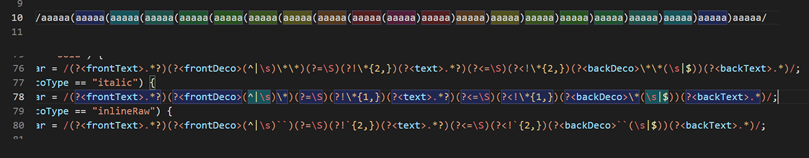
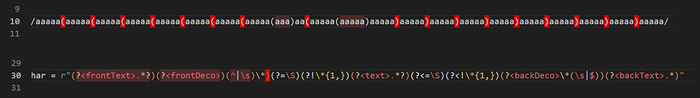
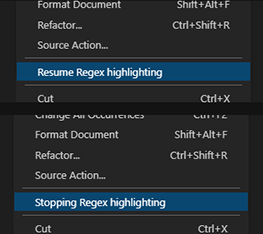
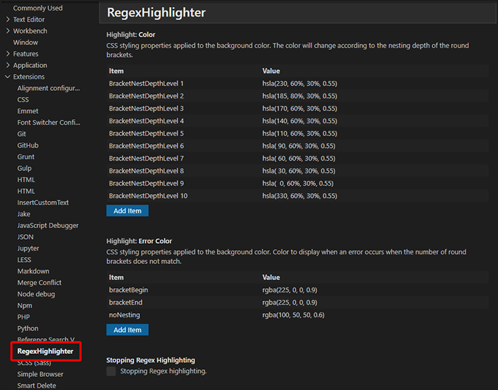

# Regex Highlighter 取扱説明書 (🗾日本語🎌)

## 概要

* 正規表現に対して、ハイライト表示を行います

## 新機能 (0.0.1)

* 丸カッコのネストの深さに応じて、文字背景色を適用します。
* 丸カッコの数が合わないときに、警告色を表示します。
* その他リリースノート: [CHANGELOG.md](https://github.com/TatsuyaNakamori/vscode-RegexHighlighter/blob/master/CHANGELOG.md)

## 寄付のお願い

* 

  or

* 

## 使用方法

* コードの中の正規表現が書かれた行を選択すると、丸カッコのネストの深さに合わせて背景色が適用されます。
* クォーテーション(Pythonなど)や、スラッシュ(JavaScriptなど)で囲われた文字列に対して適用されます
* VSCodeで適用されている、カラーテーマの文字色は邪魔しません(背景色のみ適用されます) 

* 丸カッコの数が合わない場合は、エラー表記になります。 

* ハイライト表示を止めたい場合は、`右クリック> "StoppingRegexhighlighting"` を選択します。
* ハイライト表示を再開したい場合は、`右クリック> "ResumeRegexhighlighting"` を選択します。 

## 設定 (Settings)

* 背景色を変更したい場合は、SettingsのRegexHighlighterから設定できます。 

## 既知の問題/ 将来のアップデート

* 現在、複数行の定義に対応していません (Pythonの"`re.X`", "`re.VERBOSE`"/ `(?x)` フラグ)
* 要望は[こちら](https://github.com/TatsuyaNakamori/vscode-RegexHighlighter/issues)に投稿してください。

## ライセンス

* Copyright (c) 2021 Tatsuya Nakamori 
  MIT License
