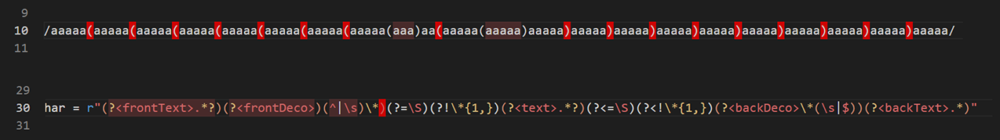

# Regex Highlighter README
* Japanese is [here](https://github.com/TatsuyaNakamori/vscode-RegexHighlighter/blob/master/README.jp.md).

## Overview

* Highlight a regular expression.

## New features (0.0.1)

* Apply a text background color according to the nesting depth of the round brackets.
* Display a warning color when the number of round brackets does not match.
* Other Release Notes: [CHANGELOG.md](https://github.com/TatsuyaNakamori/vscode-RegexHighlighter/blob/master/CHANGELOG.md)

## Donations

* 

  or

* 

## How to use

* When you select a line of code with a regular expression in it, the background color will be applied according to the depth of nesting of the round brackets.
* Applied to strings enclosed in quotation marks (e.g. Python) or slashes (e.g. JavaScript)
* Does not interfere with the color theme text color applied in VSCode (only the background color is applied). 

* If the number of round brackets does not match, an error message will be displayed. 

* If you want to stop highlighting, select `right-click>"StoppingRegexhighlighting"`.
* If you want to resume highlighting, select `right-click>"ResumeRegexhighlighting"`. 

## Settings

* If you want to change the background color, you can set it from RegexHighlighter in Settings. 

## Known issues / future updates

* Currently, multi-line definitions are not supported (Python's "`re.X`", "`re.VERBOSE`"/ `(?x)` flags)
*  Please post your requests to [here](https://github.com/TatsuyaNakamori/vscode-RegexHighlighter/issues).

## License

* Copyright (c) 2021 Tatsuya Nakamori 
  MIT License
